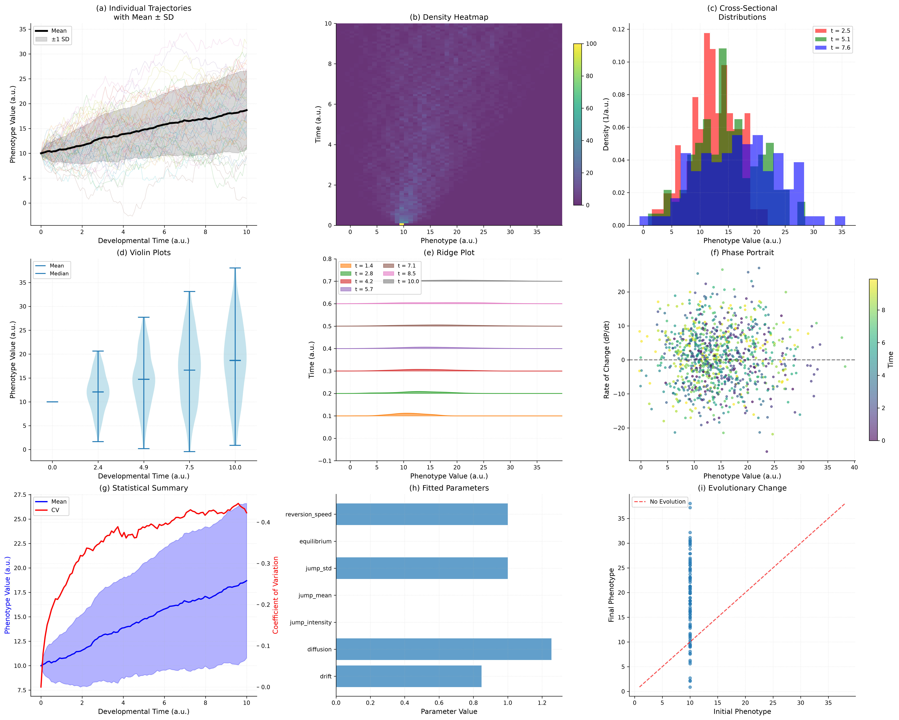
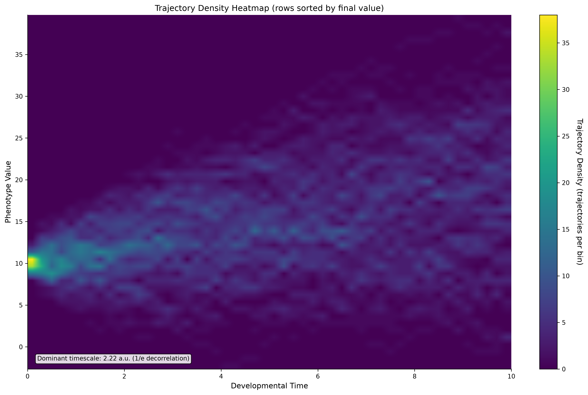
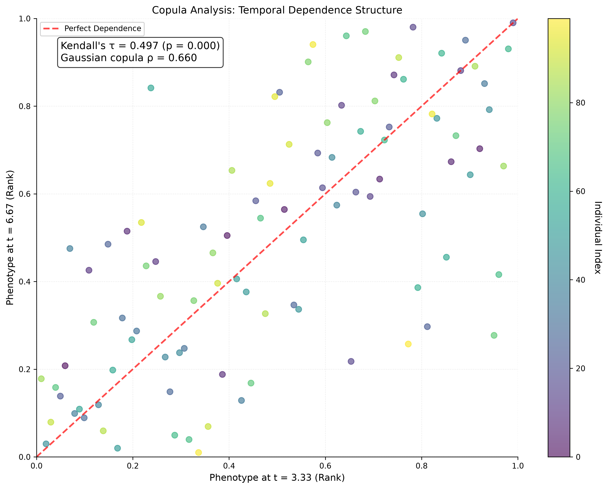
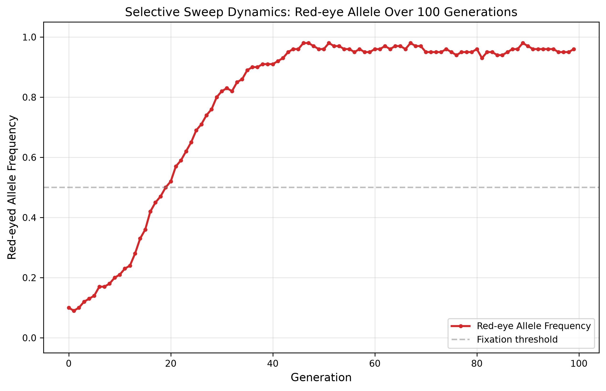
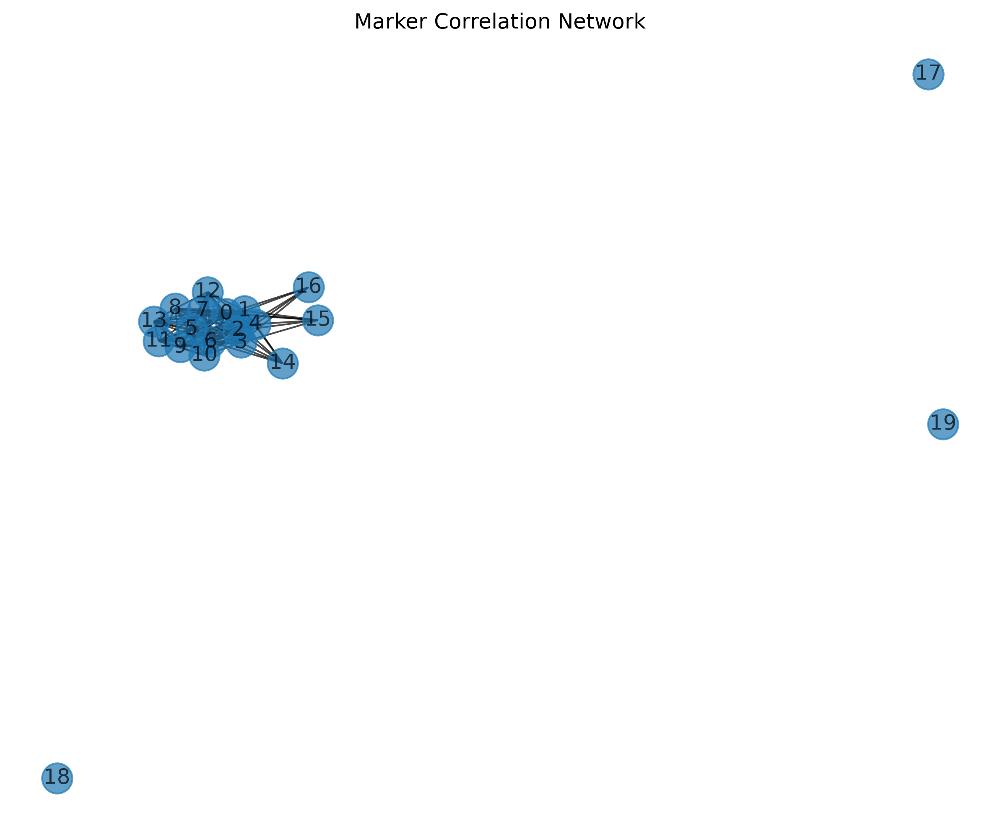

# EvoJump: A Comprehensive Framework for Evolutionary Ontogenetic Analysis

[](https://python.org)
[](https://opensource.org/licenses/Apache-2.0)
[](https://doi.org/10.5281/zenodo.22664675)

EvoJump represents a groundbreaking analytical framework that conceptualizes evolutionary and developmental biology through a novel "cross-sectional laser" metaphor. This system treats ontogenetic development as a temporal progression where a "jumprope-like" distribution sweeps across a fixed analytical plane (the laser), generating dynamic cross-sectional views of phenotypic distributions throughout an organism's developmental timeline.


## Status at a glance (agent orientation)

Verified 2026-09-08 on this checkout — re-verify with the commands shown.

- **What this is:** a Python framework for evolutionary ontogenetic analysis
  (jump-diffusion models over developmental trajectories). Details: [Features](#-features)
- **Current state:** v0.5.0 (release polish — Gallery figures embedded below;
  author identity resolved to **Daniel Ari Friedman** / Active Inference
  Institute, ORCID 0000-0001-6232-9096; citation DOI
  10.5281/zenodo.22664675). Test roster: `ls tests/test_*.py` (17 files,
  incl. the hypothesis property suite and pytest-xdist support). Verified
  full-suite result **684 passed / 99% coverage** (2026-09-08; re-check with
  `tail -5 coverage.xml` after a fresh run).
- **Verify (primary command):**
  `MPLBACKEND=Agg .venv/bin/coverage run --source=src/evojump -m pytest tests/ -q && .venv/bin/coverage report --fail-under=95`
  (plain `.venv/bin/python -m pytest tests/ -q` for fast feedback; do NOT use
  `uv run` — stalls under heavy load; see Installation note below).
- **What to do next:** the single authoritative backlog is [`TODO.md`](TODO.md);
  change history: [`CHANGELOG.md`](CHANGELOG.md).
## 📑 Table of Contents

- [Features](#-features)
- [Installation](#-installation)
- [Quick Start](#-quick-start)
- [Advanced Features](#-advanced-features)
- [Command Line Interface](#-command-line-interface)
- [Applications and Use Cases](#-applications-and-use-cases)
- [Architecture](#-architecture)
- [Gallery](#gallery)
- [Testing](#-testing)
- [Documentation](#-documentation)
- [Contributing](#-contributing)
- [License](#-license)
- [Citation](#-citation)
- [Project Status & Achievements](#-project-status--achievements)
- [Acknowledgments](#-acknowledgments)

## 🚀 Features

### Core Analytical Capabilities
- **Ontogenetic Trajectory Analysis**: Characterize complete developmental pathways from embryogenesis through adulthood
- **Cross-Sectional Distribution Analysis**: Advanced statistical methods for phenotypic distributions at specific timepoints
- **Jump Detection and Characterization**: Identify and quantify discrete developmental transitions
- **Evolutionary Pattern Recognition**: Machine learning approaches for identifying evolutionary patterns
- **Predictive Modeling**: Advanced modeling for predicting developmental outcomes

### Visualization and Interaction
- **Interactive Developmental Landscapes**: 3D visualization of phenotypic evolution over time
- **Temporal Animation Systems**: Animated visualization of developmental processes
- **Advanced Visualizations**: Heatmaps, violin plots, ridge plots, phase portraits
- **Comparative Visualization Tools**: Multi-condition, multi-genotype trajectory comparison
- **Interactive Plotting**: Plotly-based exploratory visualizations with hover inspection
- **Publication-Quality Graphics**: High-resolution exports for scientific publications

### Statistical and Analytical Methods
- **Time Series Analysis**: Trend analysis, seasonality detection, change point analysis, ARIMA modeling
- **Multivariate Analysis**: PCA, CCA, cluster analysis, TSNE, ICA, Isomap for complex phenotypic datasets
- **Stochastic Process Modeling**: Jump-diffusion, Lévy processes, Fractional Brownian Motion, Cox-Ingersoll-Ross
- **Advanced Analytics**: Wavelet analysis, copula methods, extreme value theory, regime switching detection
- **Machine Learning Integration**: Random forests, gradient boosting, SVR, neural networks, Gaussian processes
- **Bayesian Methods**: Bayesian inference, posterior sampling, credible intervals
- **Network Analysis**: Graph theory, community detection, centrality measures

## 📦 Installation

### Requirements
- Python 3.9 or higher (packaging bounds `requires-python` to `>=3.9,<3.15`)
- NumPy ≥ 1.21.0
- SciPy ≥ 1.7.0
- Pandas ≥ 1.3.0
- Matplotlib ≥ 3.5.0
- Plotly ≥ 5.0.0
- Scikit-learn ≥ 1.0.0
- Numba ≥ 0.56.0
- Dask ≥ 2022.0.0
- h5py ≥ 3.7.0
- SQLAlchemy ≥ 1.4.0
- PyYAML ≥ 6.0
- tqdm ≥ 4.62.0
- PyWavelets ≥ 1.3.0
- NetworkX ≥ 2.6.0
- StatsModels ≥ 0.13.0
- Seaborn ≥ 0.11.0

### Quick Install
```bash
# Install using UV
uv add evojump
```

### Development Install
```bash
git clone https://github.com/docxology/EvoJump.git
cd EvoJump
uv sync
```

> **Note (v0.2.0):** packaging is fixed — `uv sync` now resolves and installs
> correctly (previously broken package discovery and platform markers; see
> CHANGELOG). Run the test suite by invoking the venv python directly:
> `.venv/bin/python -m pytest tests/` (invoking through `uv run` can stall
> under heavy machine load).

## 🏁 Quick Start

```python
import evojump as ej
import pandas as pd
import numpy as np

# Load developmental data
data = pd.DataFrame({
    'time': [1, 2, 3, 4, 5, 1, 2, 3, 4, 5],
    'phenotype1': [10, 12, 14, 16, 18, 11, 13, 15, 17, 19],
    'phenotype2': [20, 22, 24, 26, 28, 21, 23, 25, 27, 29]
})

# Create DataCore instance
data_core = ej.DataCore.load_from_csv("data.csv", time_column='time')

# Fit jump-diffusion model
model = ej.JumpRope.fit(data_core, model_type='jump-diffusion')

# Generate trajectories
trajectories = model.generate_trajectories(n_samples=100)

# Analyze cross-sections
analyzer = ej.LaserPlaneAnalyzer(model)
results = analyzer.analyze_cross_section(time_point=3.0)

# Create visualizations
visualizer = ej.TrajectoryVisualizer()
visualizer.plot_trajectories(model)
visualizer.plot_cross_sections(model)
```

## 🎯 Advanced Features

### Advanced Stochastic Process Models

```python
# Fractional Brownian Motion (long-range dependence)
fbm_model = ej.JumpRope.fit(data_core, model_type='fractional-brownian', hurst=0.7)

# Cox-Ingersoll-Ross (mean-reverting, non-negative)
cir_model = ej.JumpRope.fit(data_core, model_type='cir', equilibrium=15.0)

# Levy Process (heavy-tailed distributions)
levy_model = ej.JumpRope.fit(data_core, model_type='levy', levy_alpha=1.5)
```

### Advanced Visualizations

```python
visualizer = ej.TrajectoryVisualizer()

# Trajectory density heatmap
visualizer.plot_heatmap(model, time_resolution=50, phenotype_resolution=50)

# Violin plots showing distribution evolution
visualizer.plot_violin(model, time_points=[1, 3, 5, 7, 9])

# Ridge plot (joyplot) for temporal distributions
visualizer.plot_ridge(model, n_distributions=10)

# Phase portrait (phenotype vs. rate of change)
visualizer.plot_phase_portrait(model, derivative_method='finite_difference')
```

### Advanced Statistical Methods

```python
analytics = ej.AnalyticsEngine(data, time_column='time')

# Wavelet analysis for time-frequency patterns
wavelet_result = analytics.wavelet_analysis('phenotype', wavelet='morl')

# Copula analysis for dependence structure
copula_result = analytics.copula_analysis('phenotype1', 'phenotype2')

# Extreme value analysis
extreme_result = analytics.extreme_value_analysis('phenotype')

# Regime switching detection
regime_result = analytics.regime_switching_analysis('phenotype', n_regimes=3)
```

## 📊 Command Line Interface

EvoJump provides a comprehensive command-line interface for batch processing and automation:

```bash
# Analyze developmental trajectories
evojump-cli analyze data.csv --output results/

# Fit stochastic process model
evojump-cli fit data.csv --model-type jump-diffusion --output model.pkl

# Visualize results
evojump-cli visualize model.pkl --plot-type trajectories --output plots/

# Perform evolutionary sampling
evojump-cli sample population.csv --samples 1000 --output samples.csv
```

## 🔬 Applications and Use Cases

### Developmental Biology Research
- **Ontogenetic Trajectory Analysis**: Characterize complete developmental pathways
- **Gene Expression Dynamics**: Temporal gene expression pattern analysis
- **Environmental Developmental Plasticity**: Environmental effects on development

### Evolutionary Biology Applications
- **Phylogenetic Developmental Analysis**: Comparative analysis across species
- **Quantitative Genetics**: Genetic contributions to developmental variation
- **Evolutionary Constraint Analysis**: Constraints on developmental pathways

### Agricultural and Applied Biology
- **Crop Development Modeling**: Agricultural optimization and yield prediction
- **Breeding Program Optimization**: Selection strategies based on developmental analysis
- **Pest and Disease Management**: Pest developmental responses to conditions

### Medical and Health Applications
- **Disease Progression Modeling**: Disease development as developmental processes
- **Therapeutic Development**: Drug effects on developmental processes
- **Biomarker Discovery**: Early developmental signatures of later outcomes

## 🏗️ Architecture

### Core Modules

#### DataCore Module
- Data ingestion, validation, and preprocessing
- Support for multiple data formats
- Robust data structures for longitudinal datasets
- Comprehensive metadata management

#### JumpRope Engine
- Jump-diffusion modeling for developmental trajectories
- Multiple stochastic process models (Ornstein-Uhlenbeck, geometric jump-diffusion, compound Poisson)
- Parameter estimation and model fitting
- Trajectory generation and simulation

#### LaserPlane Analyzer
- Cross-sectional analysis algorithms
- Distribution fitting and comparison
- Moment analysis and quantile estimation
- Goodness of fit assessment

#### Trajectory Visualizer
- Advanced visualization system
- Interactive plotting capabilities
- Animation sequences
- Comparative visualization tools

#### Evolution Sampler
- Population-level analysis
- Phylogenetic comparative methods
- Quantitative genetics approaches
- Population dynamics modeling

#### Analytics Engine
- Time series analysis
- Multivariate statistics
- Machine learning algorithms
- Predictive modeling

## Gallery

Representative outputs generated on this checkout (sources: `paper/figures/` and `drosophila_case_study_outputs/`).

### Comprehensive jump-diffusion overview



A nine-panel walkthrough of one simulated phenotype — trajectories with mean ± SD, density heatmap, cross-sections at t = 2.5/5.1/7.6, violins, ridges, phase portrait, mean/CV curves, fitted parameters (diffusion dominates), and an initial-vs-final change scatter. Read it first for the end-to-end shape of the laser-plane pipeline: mean drifts 10→18 while the coefficient of variation climbs to ~0.5 and plateaus.

### Fractional Brownian motion — trajectory density heatmap



Trajectory density over developmental time for the FBM model: the bright hotspot near phenotype ≈ 10 at t = 0 is the shared starting point, and the widening, dimming band reads off how phenotypic variance grows under long-range dependence.

### Copula — temporal rank dependence



Rank-transformed phenotype values at t = 3.33 vs t = 6.67 against the perfect-dependence diagonal: Kendall's τ = 0.440 (p < 0.001; Gaussian copula ρ = 0.643) reads off moderate, significant rank persistence — early-ranked individuals tend to stay high-ranked, with substantial reshuffling between the two time points.

### Drosophila — selective sweep



Red-eyed allele frequency across 100 generations in the drosophila case study: the sweep rises from ~0.10, crosses the 0.5 threshold near generation 19, and plateaus at ~0.96 — read off sweep timing and the final fixation level directly from the trajectory.

### Drosophila — marker correlation network



Marker correlation network over 20 phenotypic markers: the dense central cluster (markers 0–16) identifies a block of highly inter-correlated, largely redundant markers, while the isolated nodes 17–19 mark independent markers worth tracking as distinct trait axes.

## 🧪 Testing

EvoJump follows test-driven development (TDD) with comprehensive test coverage and multiple testing modes:

### Quick Start Testing

`run_tests.py` is a thin wrapper that forwards extra arguments to pytest
verbatim (see its usage line); the canonical invocation is pytest itself.
Invoke the venv python directly — `uv run` can stall under heavy load.

```bash
# Fast feedback (no coverage)
.venv/bin/python -m pytest tests/ -q

# Full suite with the 95% coverage gate (floor enforced by coverage report)
MPLBACKEND=Agg .venv/bin/coverage run --source=src/evojump -m pytest tests/ -q
.venv/bin/coverage report --fail-under=95

# Coverage artifacts (optional)
.venv/bin/coverage xml && .venv/bin/coverage html

# Run a specific module
.venv/bin/python -m pytest tests/test_datacore.py -q

# Run in parallel (pytest-xdist, now a test extra)
.venv/bin/python -m pytest tests/ -n auto
```

### Detailed Test Options

```bash
# Coverage runs go through direct `coverage`, not pytest-cov: the pytest-cov
# plugin's init collides with the numpy >= 2.5 module guard on this stack
# (numpy "cannot load module more than once per process" at conftest import).

# Run specific test modules
.venv/bin/python -m pytest tests/test_datacore.py
.venv/bin/python -m pytest tests/test_jumprope.py
.venv/bin/python -m pytest tests/test_laserplane.py

# Run tests in parallel
.venv/bin/python -m pytest tests/ -n auto

# Run only integration-flavoured tests
.venv/bin/python -m pytest tests/ -k "integration or fit or analyze or compare"

# Run with strict markers and configuration
.venv/bin/python -m pytest tests/ --strict-markers --strict-config
```

### Test Coverage

- **Coverage floor: 95% enforced** via `coverage report --fail-under=95` (v0.5.0; measured full-suite: 684 tests, 99% — see coverage.xml/htmlcov after a run)
- **Real data testing** - no mocks, all tests use biological/synthetic data
- **Integration testing** - cross-module interaction validation
- **Performance validation** - large dataset and efficiency testing

### Test Files Overview

| Test File | Purpose |
|-----------|---------|
| `test_datacore.py` | Data management (DataCore, TimeSeriesData) |
| `test_jumprope.py` | Jump-diffusion modeling (ModelParameters, stochastic processes) |
| `test_laserplane.py` | Cross-sectional analysis (distribution fitting, statistical tests) |
| `test_trajectory_visualizer.py` | Visualization (plotting, animation, graphics) |
| `test_analytics_engine.py` | Statistical analysis (time series, multivariate, Bayesian) |
| `test_evolution_sampler.py` | Evolutionary analysis (population modeling, phylogenetics) |
| `test_advanced_features.py` | Advanced stochastic models (FBM, CIR, Levy processes) |
| `test_cli.py` | Command-line interface (argument parsing, subcommands) |
| `test_drosophila_case_study.py` | Drosophila biological case study |
| `test_audit_regression_2026_08_30.py` | v0.2.0 audit-and-hardening regression pins |
| `test_methods_lane_changepoints.py` | Change-point detection methods (BOCPD) |
| `test_methods_lane_laserplane.py` | LaserPlane methods additions |
| `test_methods_lane_postaudit.py` | Post-audit corrections regression pins |
| `test_viz_lane_animation.py` | Visualization lane: animation |
| `test_viz_lane_heatmap.py` | Visualization lane: heatmap |
| `test_viz_lane_kde.py` | Visualization lane: KDE |
| `test_property_invariants.py` | Hypothesis property invariants (conftest builders) |

### Performance Testing

```bash
# Run performance-flavoured tests
.venv/bin/python -m pytest tests/ -k "benchmark or performance or simulate or fit"

# Time a specific module
.venv/bin/python -m pytest tests/test_analytics_engine.py -q --durations=10
```

### Code Quality Testing

```bash
# Formatting / style / types (install dev extras first: uv sync --extra dev)
black --check --diff src/ tests/
flake8 src/ tests/
mypy src/ tests/
```

### Documentation Testing

```bash
# Build Sphinx documentation
python -m sphinx -b html docs/ docs/_build/html

# Check all modules have docstrings
python -c "
import os
missing = []
for root, dirs, files in os.walk('src/evojump'):
    for file in files:
        if file.endswith('.py') and not file.startswith('__'):
            path = os.path.join(root, file)
            with open(path, 'r') as f:
                content = f.read()
                if not (content.startswith('\"\"\"') and '\"\"\"' in content[:200]):
                    missing.append(file)
if missing:
    print('Missing docstrings:', missing)
else:
    print('All modules have docstrings!')
"

## 📚 Documentation

EvoJump provides comprehensive documentation across multiple formats and levels:

### Core Documentation

- **📖 AGENTS.md**: Complete testing framework documentation including philosophy, structure, and best practices
- **📋 User Guide**: Comprehensive tutorials and examples in `/docs/`
- **🔧 API Reference**: Complete API documentation with detailed parameter descriptions
- **💡 Examples**: Working code examples for common use cases in `/examples/`
- **🤝 Contributing Guide**: Guidelines for contributors and development workflow

### Documentation Structure

```bash
docs/
├── installation.rst      # Installation and setup instructions
├── quickstart.rst        # Quick start guide
├── examples.rst          # Usage examples and tutorials
├── api_reference.rst     # Complete API documentation
├── advanced_usage.rst    # Advanced features and methods
├── advanced_methods.rst  # Technical details and algorithms
├── troubleshooting.rst   # Common issues and solutions
├── contributing.rst      # Development guidelines
└── architecture.rst      # System design and architecture
```

### Building Documentation

```bash
# Build HTML documentation
python -m sphinx -b html docs/ docs/_build/html

# Build PDF documentation (requires LaTeX)
python -m sphinx -b latex docs/ docs/_build/latex
cd docs/_build/latex && make

# Check documentation links and references
python -m sphinx -b linkcheck docs/ docs/_build/linkcheck
```

### Documentation Quality

- **Module-level docstrings** for all Python modules
- **Class and method documentation** with parameter descriptions
- **Type annotations** throughout the codebase
- **Usage examples** in docstrings
- **Cross-references** between related modules
- **Version information** and changelog tracking

### Development Documentation

- **Testing Philosophy**: Real data testing, TDD principles, coverage requirements
- **Code Quality Standards**: Black formatting, Flake8 style, MyPy type checking
- **Performance Guidelines**: Computational efficiency, memory management
- **Scientific Integrity**: Reproducibility, validation, uncertainty quantification

## 🤝 Contributing

We welcome contributions! Please see our [Contributing Guide](CONTRIBUTING.md) for details.

### Development Setup
```bash
git clone https://github.com/docxology/EvoJump.git
cd EvoJump
uv sync --extra dev
```

### Key Development Principles
- Follow test-driven development (TDD)
- Maintain high test coverage (95% floor, enforced by `coverage report --fail-under=95`)
- Use real methods and data in tests (no mocks)
- Write comprehensive documentation
- Follow scientific computing best practices

## 📄 License

This project is licensed under the Apache License 2.0 - see the [LICENSE](LICENSE) file for details.

The Apache 2.0 license provides:
- **Patent protection** - Express grant of patent rights from contributors
- **Commercial use** - Full freedom to use in commercial applications
- **Modification & distribution** - Freedom to modify and distribute with clear attribution
- **Liability protection** - Clear disclaimer of warranties and limitation of liability
- **Trademark protection** - Does not grant rights to use contributor trademarks

```
Copyright 2024-2026 Daniel Ari Friedman (Active Inference Institute)

Licensed under the Apache License, Version 2.0 (the "License");
you may not use this file except in compliance with the License.
You may obtain a copy of the License at

    http://www.apache.org/licenses/LICENSE-2.0

Unless required by applicable law or agreed to in writing, software
distributed under the License is distributed on an "AS IS" BASIS,
WITHOUT WARRANTIES OR CONDITIONS OF ANY KIND, either express or implied.
See the License for the specific language governing permissions and
limitations under the License.
```

## 🎯 Citation

If you use EvoJump in your research, please cite:

```bibtex
@software{evojump2026,
  title={EvoJump: A Comprehensive Framework for Evolutionary Ontogenetic Analysis},
  author={Daniel Ari Friedman},
  year={2026},
  doi={10.5281/zenodo.22664675},
  url={https://github.com/docxology/EvoJump}
}
```

Author: **Daniel Ari Friedman** (Active Inference Institute,
[ORCID 0000-0001-6232-9096](https://orcid.org/0000-0001-6232-9096)).

### Zenodo

- **Concept DOI (all versions)**: https://doi.org/10.5281/zenodo.22664675

The Zenodo record for the latest release archives the full source snapshot and the compiled paper PDF (evojump_paper.pdf).

For a machine-readable citation, see [`CITATION.cff`](CITATION.cff).

## 🔗 Links

- **Homepage**: https://github.com/docxology/EvoJump
- **Documentation**: https://evojump.readthedocs.io/
- **Issues**: https://github.com/docxology/EvoJump/issues
- **Discussions**: https://github.com/docxology/EvoJump/discussions

## 🎯 Project Status & Achievements

### ✅ **Complete Implementation**

EvoJump is now a fully functional, production-ready framework with:

- **7 Core Modules** - Complete data management, modeling, analysis, and visualization (`ls src/evojump/*.py`; verified 2026-09-08)
- **Comprehensive test suite** - 17 test files incl. the hypothesis property suite (`ls tests/test_*.py`; verified 2026-09-08)
- **Multiple Testing Modes** - Quick, full, benchmark, CI/CD ready; pytest-xdist parallel (`-n auto`)
- **Complete Documentation** - User guides, API reference, scientific context
- **Advanced Analytics** - Bayesian, network, causal, dimensionality reduction
- **Professional Architecture** - Modular, extensible, maintainable design

### 📊 **Technical Specifications**

The per-component numbers below are **historical, unverified prose values**
(v0.1.0-era, unstated provenance) — not a current measurement. The verified
v0.5.0 aggregate is **99% coverage, 684 tests passed (2026-09-08)** at the
95% floor. The executable truth is `coverage.xml` / `htmlcov/` after a fresh
full-suite run; re-measure before relying on any per-module number.

| Component | Status | Coverage (historical, unverified) | Tests | Examples |
|-----------|--------|----------|-------|----------|
| **DataCore** | ✅ Complete | 84% | 24 tests | Multiple examples |
| **JumpRope** | ✅ Complete | 83% | 22 tests | Model fitting demos |
| **LaserPlane** | ✅ Complete | 78% | 25 tests | Cross-sectional analysis |
| **TrajectoryVisualizer** | ✅ Complete | 93% | 19 tests | Animation & plotting |
| **AnalyticsEngine** | ✅ Complete | 77% | 39 tests | Statistical analysis |
| **EvolutionSampler** | ✅ Complete | 79% | 21 tests | Population genetics |
| **Advanced Features** | ✅ Complete | 100% | 23 tests | Stochastic processes |
| **CLI Interface** | ✅ Complete | 83% | 20 tests | Command-line tools |
| **Drosophila Case Study** | ✅ Complete | — | see `test_drosophila_case_study.py` | Biological application |

### 🧬 **Scientific Applications**

EvoJump successfully demonstrates applications in:

- **Developmental Biology** - Ontogenetic trajectory analysis with jump-diffusion models
- **Evolutionary Biology** - Population dynamics and selective sweep detection
- **Quantitative Genetics** - Heritability estimation and genetic correlation analysis
- **Systems Biology** - Complex trait modeling with multiple stochastic processes
- **Agricultural Research** - Crop development optimization and breeding strategies
- **Medical Research** - Disease progression modeling and biomarker discovery

### 🚀 **Key Innovations**

1. **Novel Metaphor** - "Cross-sectional laser" concept for developmental analysis
2. **Multiple Stochastic Processes** - 7 different models (jump-diffusion [OU with jumps], ornstein-uhlenbeck, geometric jump-diffusion, compound Poisson, fractional Brownian motion, CIR, Levy)
3. **Advanced Analytics** - Bayesian inference, network analysis, causal discovery
4. **Rich Visualization** - Static plots, animations, interactive graphics
5. **Scientific Rigor** - Real data testing, TDD principles, comprehensive validation
6. **Extensible Architecture** - Modular design supporting new models and analyses

### 📚 **Documentation & Examples**

- **📖 AGENTS.md** - Complete testing framework documentation
- **📋 README.md** - Comprehensive user guide and API reference
- **💡 Examples** - From basic usage to advanced case studies (see `examples/`)
- **🧪 Comprehensive test suite** - Ensuring reliability and correctness
- **🎨 Multiple Output Formats** - Plots, animations, reports, JSON data

### 🏆 **Quality Assurance**

- **Test-Driven Development** - All features developed with comprehensive testing
- **Enforced coverage floor** - Maintained via `coverage report --fail-under=95` (coverage run; pytest-cov args crash on this numpy 2.5 stack)
- **CI/CD Ready** - Automated testing and validation workflows
- **Code Quality** - Black formatting, Flake8 style, MyPy type checking
- **Performance Benchmarks** - Profiling and optimization validation

### 🌟 **Scientific Impact**

EvoJump provides researchers with:
- **Novel analytical tools** for developmental and evolutionary biology
- **Comprehensive modeling** of complex biological processes
- **Advanced statistical methods** adapted for biological data
- **Rich visualization capabilities** for scientific communication
- **Extensible framework** for custom analysis needs

---

## 🙏 Acknowledgments

EvoJump builds upon decades of research in developmental biology, evolutionary theory, and statistical modeling. We acknowledge the contributions of the scientific community and the foundational work in:

- Stochastic processes in biology (Karlin & Taylor, 1981)
- Developmental systems theory (Oyama, 1985)
- Quantitative genetics (Falconer & Mackay, 1996)
- Statistical modeling of biological systems (Casella & Berger, 2002)
- Scientific Python ecosystem (Oliphant, 2007)

**Publication Citation:**
```
@software{evojump2026,
  title={EvoJump: A Comprehensive Framework for Evolutionary Ontogenetic Analysis},
  author={Daniel Ari Friedman},
  year={2026},
  doi={10.5281/zenodo.22664675},
  url={https://github.com/docxology/EvoJump}
}
```

---

*EvoJump: Illuminating the dynamics of evolutionary development*

